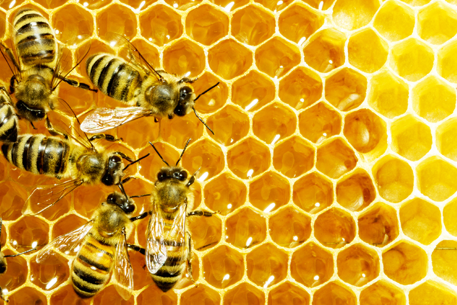
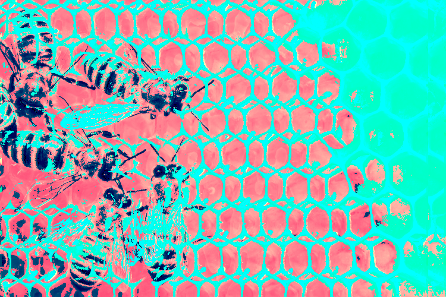

# pixelsnort
playing with channels and sorting pixels

 

Put it up on a server real quick or else you will get the dreaded cross-contamination error

python -m SimpleHTTPServer
or
php -S localhost:8000

http://slides.com/elizabethwilliams-1/pixelsorting-in-javascript#/
